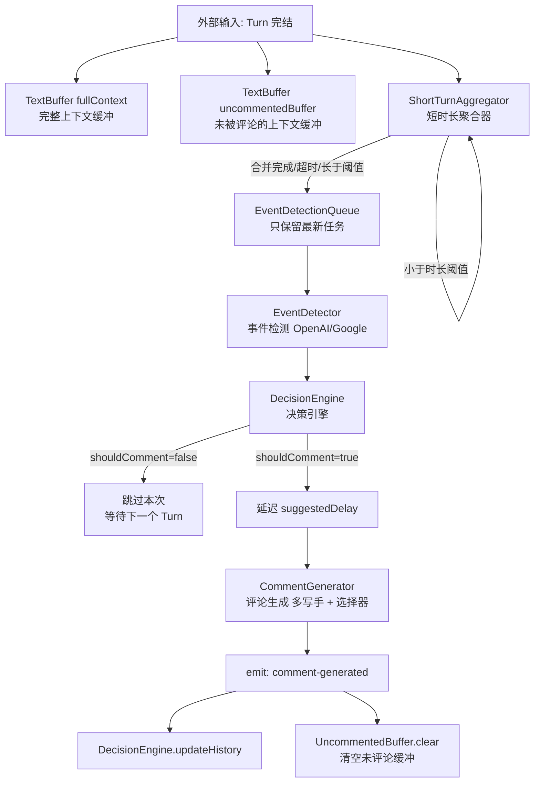
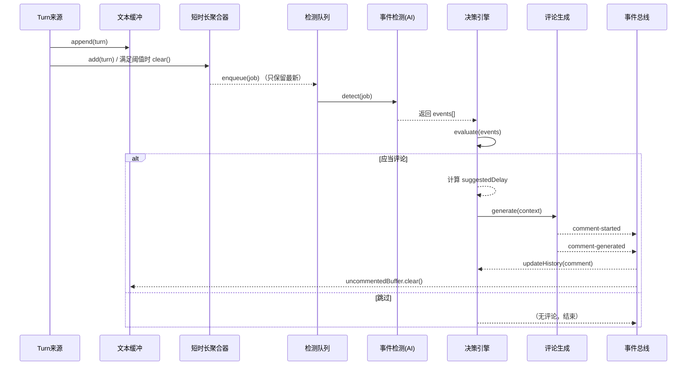

## 评论系统参数与架构指南（给仅调整配置的测试者）

本文面向只会调整配置参数、不直接写代码的测试者。你将了解系统整体如何工作、各参数的含义与默认值、以及常见调参范式（带示例）。

### 我们要解决的问题
- **系统目标**：在实时对话/字幕流中，自动识别值得“评论”的时刻，并生成一句高质量评论。
- **你能做什么**：仅修改配置参数（在 `packages/core/src/config.ts` 暴露的各配置项）以改变“何时评论、评论频率、上下文窗口、检测敏感度、生成风格”等行为。

---

## 总体架构（高层）



关键点：
- 系统持续接收“说话段”（Turn）。每个 Turn 结束时会进入缓冲与判定流程。
- 短时长的 Turn 会被聚合，避免对非常碎片化的文本做无意义检测。
- 事件检测（AI）产出若干“事件”与置信度，交给决策引擎（规则+加权+动态阈值）。
- 决策引擎若判定应当评论，会按优先级给出延迟，再由评论生成模块产出一条评论。
- 生成后：记录评论历史，清空“未评论缓冲”（确保下一次更聚焦新内容）。

---

## 时间线（顺序图）



---

## 你能调整的配置项

所有配置通过 `ConfigInput` 合并到默认值中生效（无需提供全部字段）。下面以功能分组进行解释，并给出调参建议与默认值范围认知。

### 1) API Keys
- **apiKeys.openai**: 使用 OpenAI 相关能力（事件检测=OpenAI、评论生成=OpenAI Agents）时需要。
- **apiKeys.google**: 使用 Google Gemini 做事件检测时需要。

注意：评论生成目前依赖 OpenAI Agents SDK，故即使事件检测切到 Google，仍需提供 `openai` key 来生成评论。

### 2) 评论生成 commentGenerator
- **writers: Array<{ name, instructions, minLength, maxLength, model? }>`**
  - 配置多个“写手”（风格/口吻）。系统会让风格选择器在这些写手候选中挑一个输出。
  - `instructions`: 写手风格提示。`minLength/maxLength`: 字数控制。
  - `model` 可选：指定具体模型；不填则使用选择器默认。
- **selectorModel: string**
  - 风格选择器使用的模型；默认 `"gpt-5-mini"`。
- **selectorInstructions: string**
  - 风格选择器的偏好提示


### 3) 事件检测 eventDetector
- **modelProvider: "openai" | "google"**：事件检测服务商。
- **model: string**：模型名，例如 `"gpt-5-nano"` 或 `"gemini-1.5-flash"`。
- **detectionSensitivity: number (0-1)**：最低“置信度”阈值；越高越保守。
- **emotionThreshold: number (0-1)**：情绪峰值事件的“强度”最低阈值。
- **topicTransitionThreshold: number (0-1)**：主题变更/提问/结论/总结等事件的强度阈值。
- **keypointDensityThreshold: number (0-1)**：关键信息（key_point）事件的强度阈值。

调参要点：
- 误报多：提高 `detectionSensitivity` 与对应强度阈值（如 `emotionThreshold`）。
- 检测更积极：降低以上阈值，但要配合决策引擎控制评论频率。
- 切换供应商：将 `modelProvider` 切至 `google` 并提供 `apiKeys.google`。

默认（参考）：`detectionSensitivity=0.7`，`emotionThreshold=0.75`，`topicTransitionThreshold=0.3`，`keypointDensityThreshold=0.5`，`modelProvider="openai"`，`model="gpt-5-nano"`。

### 4) 决策引擎 decisionEngine
- **baseThreshold: number (0-1)**：基础阈值；最终得分超过“动态阈值”才会评论。系统会在此基础上自适应上调/下调。
- **minInterval / maxInterval: number（秒）**：两次评论的最小/最大间隔，会影响“时机（timing）因子”和延迟计算。
- 各因子权重（0-1）：
  - **emotionWeight**（情绪峰值）、**topicWeight**（主题变更）、**timingWeight**（时间因子）、**importanceWeight**（重要性：结论/要点/总结）、**keywordWeight**（问题事件）。
- **frequencySuppression: number (0-1)**：频率抑制基准，系统会根据近 90 秒评论数动态抑制；该值越低总体越保守。
- **timeDecayRate: number (0-1)**：时间衰减率，越低表示对“离上次评论越近”的情况抑制更强。

内部机制摘要：
- 引擎会计算各因子分数的加权和，叠加“内容质量加分”（由事件给出的 0-10 质量分换算）。
- 然后应用两个修正：时间衰减（越近越低）和频率抑制（近 90 秒评论越多越低）。
- 结果与“动态阈值”比较。动态阈值会根据“评论太频繁/太稀疏”自动微调。
- 若决定评论，还会给出 `priority` 与 `suggestedDelay(ms)`，以避免打断或抢节奏。

默认（参考）：`baseThreshold=0.65`，`minInterval=20s`，`maxInterval=90s`，权重：emotion=0.2, topic=0.4, timing=0.15, importance=0.6, keyword=0.3，`frequencySuppression=0.8`，`timeDecayRate=0.95`。

调参要点：
- 更保守：提高 `baseThreshold`，提高权重集中在“importance/topic”，拉大 `minInterval`。
- 更积极：降低 `baseThreshold`，提高 `keywordWeight/topicWeight`，缩小 `minInterval`。

### 5) 文本缓冲 TextBuffer（两份）
系统维护两份缓冲：
- **contextBuffer**（完整上下文）：保留更长历史，用于生成与检测的“背景”。
- **uncommentedBuffer**（未评论上下文）：只累计自上次评论后的内容；一旦生成评论就会被清空，用于让检测与生成更聚焦“最近未被覆盖”的内容。

每份缓冲都支持以下参数：
- **bufferSize（词数）**：最多保留多少词的容量（超过会自然淘汰旧内容）。
- **windowDuration（秒）**：取“最近多少秒”的窗口文本用于本次处理。
- **segmentMaxSize（词数）**：每个片段最大词数（内部切分使用）。
- **retentionTime（秒）**：整体保留时长（超时的段会被清理）。

默认（参考）：
- `contextBuffer`: bufferSize≈10000-15000 词，windowDuration≈300 秒，retentionTime≈3600 秒。
- `uncommentedBuffer`: 继承 `contextBuffer` 默认，可与其不同步调整（例如更短的 window 以更聚焦）。

调参要点：
- 评论重复/赘述：减小 `uncommentedBuffer.windowDuration`，让生成更聚焦“刚刚发生”的内容。
- 语境不足：增大 `contextBuffer.windowDuration` 或 `bufferSize`。

### 6) 短时长聚合器 shortTurnAggregator
用于将过短的 Turn 合并，避免对碎片化输入频繁触发检测：
- **minTurnDurationMs**：单个 Turn 若小于该时长，会进入聚合；否则直接作为“就绪 Turn”。
- **aggregationMaxDelayMs**：聚合等待的最大时长，超时会将已有短片段合并输出。
- **aggregationMaxGapMs**：短片段之间允许的最大间隔，间隔过大则不再合并。
- **aggregationMaxWords（可选）**：累计词数上限，超过则立刻输出合并结果。
- **aggregationMaxTotalDurationMs（可选）**：累计时长上限，超过则立刻输出合并结果。

默认（参考）：`minTurnDurationMs=1200`，`aggregationMaxDelayMs=800`，`aggregationMaxGapMs=400`，`aggregationMaxWords=50`，`aggregationMaxTotalDurationMs=12000`。

调参要点：
- 输入切分过碎：提高 `minTurnDurationMs` 或降低 `aggregationMaxDelayMs`（尽快合并再检测）。
- 延迟过高：适当降低 `aggregationMaxDelayMs`，并在决策引擎里缩短 `suggestedDelay` 的触发（通过降低 `minInterval` 与 `baseThreshold` 等整体趋于积极）。

### 7) 其他重要行为
- 队列策略：`EventDetectionQueue` 始终只保留“最新”任务（如果快速连续输入，旧任务会被替换），确保系统“追最新”。
- 过期丢弃：队列会用系统常量 `MAX_TURN_STALENESS_MS=5000`ms 判断陈旧任务并丢弃（降低延迟与过时评论）。

---

## 常见调参范式

### 示例 A：少但更高质量的评论（偏稳健）

```json
{
  "commentGenerator": {
    "writers": [
      {
        "name": "ConcisePro",
        "instructions": "简洁高信噪、补充关键背景，不复述原文",
        "minLength": 24,
        "maxLength": 90
      }
    ],
    "selectorModel": "gpt-5-mini",
    "selectorInstructions": "偏向信息密度高且不打断节奏的候选"
  },
  "eventDetector": {
    "modelProvider": "openai",
    "model": "gpt-5-nano",
    "detectionSensitivity": 0.8,
    "emotionThreshold": 0.8,
    "topicTransitionThreshold": 0.4,
    "keypointDensityThreshold": 0.6
  },
  "decisionEngine": {
    "baseThreshold": 0.75,
    "minInterval": 45,
    "maxInterval": 120,
    "emotionWeight": 0.15,
    "topicWeight": 0.4,
    "timingWeight": 0.2,
    "importanceWeight": 0.7,
    "keywordWeight": 0.25,
    "frequencySuppression": 0.8,
    "timeDecayRate": 0.9
  },
  "contextBuffer": { "windowDuration": 360 },
  "uncommentedBuffer": { "windowDuration": 120 },
  "shortTurnAggregator": {
    "minTurnDurationMs": 1500,
    "aggregationMaxDelayMs": 700,
    "aggregationMaxGapMs": 400,
    "aggregationMaxWords": 60
  }
}
```

预期效果：减少评论频率，更聚焦结论/要点，整体更“稳”。

### 示例 B：演示/直播场景（更活跃，及时响应）

```json
{
  "commentGenerator": {
    "writers": [
      {
        "name": "LiveCoach",
        "instructions": "友好、实时引导、不夸张，给观众可执行提示",
        "minLength": 18,
        "maxLength": 80
      },
      {
        "name": "QuickFacts",
        "instructions": "以事实点缀与简短结论为主",
        "minLength": 12,
        "maxLength": 60
      }
    ],
    "selectorModel": "gpt-5-mini",
    "selectorInstructions": "偏向更贴近当下动作的候选"
  },
  "eventDetector": {
    "modelProvider": "openai",
    "model": "gpt-5-nano",
    "detectionSensitivity": 0.6,
    "emotionThreshold": 0.65,
    "topicTransitionThreshold": 0.3,
    "keypointDensityThreshold": 0.45
  },
  "decisionEngine": {
    "baseThreshold": 0.55,
    "minInterval": 10,
    "maxInterval": 60,
    "emotionWeight": 0.2,
    "topicWeight": 0.45,
    "timingWeight": 0.15,
    "importanceWeight": 0.5,
    "keywordWeight": 0.4,
    "frequencySuppression": 0.85,
    "timeDecayRate": 0.96
  },
  "contextBuffer": { "windowDuration": 240 },
  "uncommentedBuffer": { "windowDuration": 90 },
  "shortTurnAggregator": {
    "minTurnDurationMs": 800,
    "aggregationMaxDelayMs": 600,
    "aggregationMaxGapMs": 350,
    "aggregationMaxWords": 80
  }
}
```

预期效果：更容易在话题切换/提问等节点及时产出简洁评论。

### 示例 C：将事件检测切换到 Google Gemini

```json
{
  "eventDetector": {
    "modelProvider": "google",
    "model": "gemini-1.5-flash",
    "detectionSensitivity": 0.7
  }
}
```

注意：评论生成仍使用 OpenAI Agents，请确保同时配置 `apiKeys.openai`。

---

## FAQ（面向测试者）

- **为什么我调整了 `uncommentedBuffer`，评论更贴近当前上下文了？**
  - 因为生成与检测都会优先使用“未被评论的最近窗口”，清空后会重新聚焦新内容。
- **为什么明明检测到事件却不评论？**
  - 事件只是输入，决策引擎会基于权重、时间间隔、动态阈值与抑制机制综合判断；提高 `keywordWeight` 或降低 `baseThreshold` 可能有帮助。
- **评论偶尔延迟 1-4 秒正常吗？**
  - 正常。为避免打断和“连环评论”，决策引擎会给出 `suggestedDelay`。你可以降低 `baseThreshold` 或 `minInterval` 以更激进，但注意噪声提升。
- **如何避免重复/复读型评论？**
  - 减小 `uncommentedBuffer.windowDuration`，并在选择器指令中强调“不要复述原文”。

---

## 最小化操作步骤（你只需做这几件事）

1. 准备好 `apiKeys`（至少 OpenAI；若事件检测用 Google，还需 Google）。
2. 依据场景从上面的示例拷贝一份配置片段，合并到你的配置来源中。
3. 逐步微调以下顺序：
   - 事件检测阈值（更稳 or 更活跃）
   - 决策阈值与时间（频率/延迟）
   - 未评论窗口与聚合器（上下文与切分）
   - 写手与选择器指令（风格/长度）

如需进一步帮助，请记录“某段文本+系统日志（decision=COMMENT/SKIP、score、threshold、factors 等）”一起反馈，这将极大缩短调参时间。


